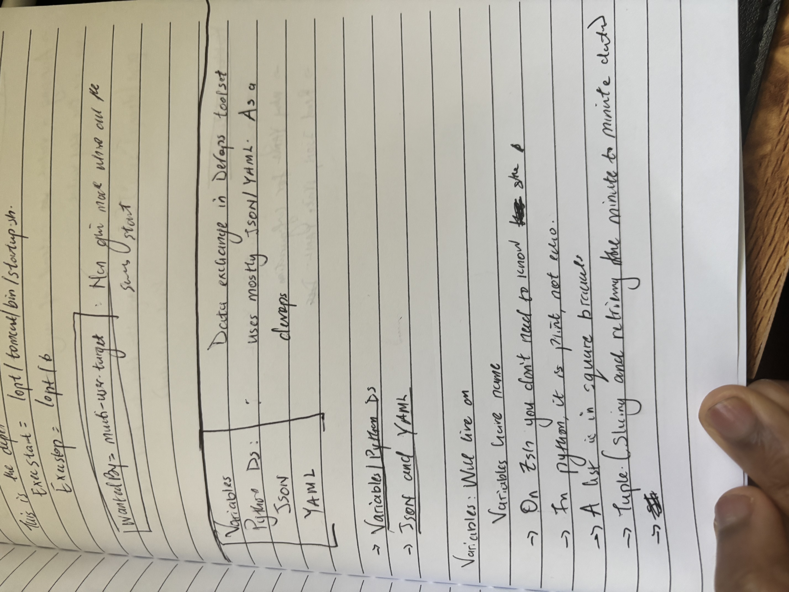

# Python Data Structures, JSON, and YAML: Foundations for DevOps

*A note to my future self: Today I dove deep into the building blocks of data representation in DevOps - Python data structures, JSON, and YAML. These are the languages that DevOps tools speak. Here's what I learned.*

## The Big Picture

DevOps toolsets use **JSON and YAML** for data exchange and configuration. Understanding Python data structures helps because many DevOps tools are written in Python, and the concepts translate directly. As a DevOps engineer, you'll be working with these formats constantly.



## Python Data Structures: The Building Blocks

### Dictionaries - Key-Value Pairs

**What I learned:** Dictionaries store data in **key-value pairs**. Unlike lists where you use index numbers (0, 1, 2...), dictionaries let you access values using meaningful keys.

**The concept:**
- **Key:** The identifier (like "skill", "name", "port")
- **Value:** The actual data stored
- **Access pattern:** `devops["skill"][0]` - Using the key to find the value you need

**Example:**
```python
devops = {
    "skill": ["terraform", "ansible", "docker"],
    "experience": "5 years"
}

# Access using key, not index
print(devops["skill"][0])  # Outputs: terraform
```

**Why this matters:** Configuration files, environment variables, and API responses often use this key-value structure. It's human-readable and makes code more maintainable.

### Lists vs Tuples

**Lists:** Defined with square brackets `[]`
- Mutable (can change after creation)
- Example: `skills = ["python", "bash", "git"]`

**Tuples:** Defined with parentheses `()`
- Immutable (cannot change after creation)
- Good for: Slicing and retrieving "minute to minute data" (temporary, unchanging data)
- Example: `config = ("server", 8080, "production")`

**The key difference:** Lists can be modified, tuples cannot. Use tuples when you want to guarantee the data won't change.

### Variables: The Foundation

**Variables give names to data.** They let you store and reuse values throughout your code.

**Key insights I learned:**
- Variables "live on" - they persist in memory until explicitly deleted or the program ends
- They make code readable and maintainable
- Different languages handle variables differently (Python vs Shell)

## Shell vs Python: The Differences

**Output commands:**
- **Shell/Zsh:** `echo "Hello World"`
- **Python:** `print("Hello World")`

**Shebangs:**
- In shell scripts: `#!/bin/bash` (tells system which interpreter to use)
- In Python: Usually don't need a shebang for simple scripts, but `#!/usr/bin/env python3` is common

**Why this matters:** When writing automation scripts, you need to know which language you're using and use the correct syntax.

## JSON vs YAML: The DevOps Configuration Languages


### JSON (JavaScript Object Notation)

**What it is:** A lightweight data-interchange format that's easy for humans to read and machines to parse.

**Characteristics:**
- Uses curly braces `{}` for objects
- Uses square brackets `[]` for arrays
- Requires double quotes for strings
- No comments allowed
- Commonly used in APIs and configuration files

**Example:**
```json
{
  "server": {
    "host": "192.168.1.1",
    "port": 8080,
    "services": ["nginx", "apache"]
  }
}
```

### YAML (YAML Ain't Markup Language)

**What it is:** A human-readable data serialization format that's more readable than JSON for configuration files.

**Key characteristics I learned:**
- **Spacing is CRITICAL** - YAML uses indentation (like Python) to represent structure
- No curly braces or brackets needed
- Allows comments (with `#`)
- More human-friendly than JSON for configuration

**Why YAML for configuration:**
- **Read JSON, Write YAML** - This is a common DevOps workflow
- Easier to read and write for humans
- Used by Ansible, Kubernetes, Docker Compose, and many other DevOps tools
- Less error-prone for configuration files (no worrying about trailing commas, quote escaping)

**Example:**
```yaml
server:
  host: 192.168.1.1
  port: 8080
  services:
    - nginx
    - apache
```

## The DevOps Toolset Connection

**The pattern I noticed:**
- **Python Data Structures** → Understanding how data is organized in code
- **JSON** → Machine-to-machine communication, APIs, some configs
- **YAML** → Human-readable configuration files, infrastructure as code

**As a DevOps engineer, you work with:**
- Ansible playbooks (YAML)
- Kubernetes manifests (YAML)
- Docker Compose files (YAML)
- Terraform configurations (HCL, but similar concepts)
- API responses (JSON)
- Configuration files (both JSON and YAML)

## Key Takeaways for Future Me

1. **Dictionaries use keys, not indices** - This is fundamental for working with configuration data
2. **YAML spacing matters** - Just like Python, indentation defines structure. One wrong space can break everything
3. **Read JSON, Write YAML** - This workflow makes sense because JSON is machine-friendly, YAML is human-friendly
4. **Python concepts apply everywhere** - Understanding Python data structures helps with understanding how DevOps tools organize data
5. **Variables give names to data** - Good variable naming makes automation scripts maintainable

## What I Should Practice Next

- Writing Ansible playbooks (YAML practice)
- Parsing JSON responses from APIs
- Converting between JSON and YAML formats
- Understanding how configuration files map to Python data structures
- Working with nested data structures (dictionaries within lists, lists within dictionaries)

## Resources to Remember

- **YAML syntax:** Spacing is critical, use `#` for comments
- **JSON syntax:** Double quotes required, no comments
- **Python dicts:** Access with `dict["key"]` or `dict.get("key")`
- **Data exchange in DevOps:** Mostly JSON/YAML
- **System configuration:** Often uses these formats with tools like Ansible, Terraform

---

*Future me: These concepts are the foundation. Master these, and reading/writing configuration files, playbooks, and manifests becomes much easier. Don't skip the fundamentals!*
